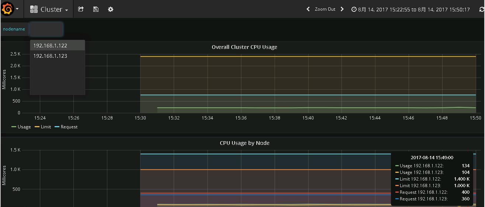
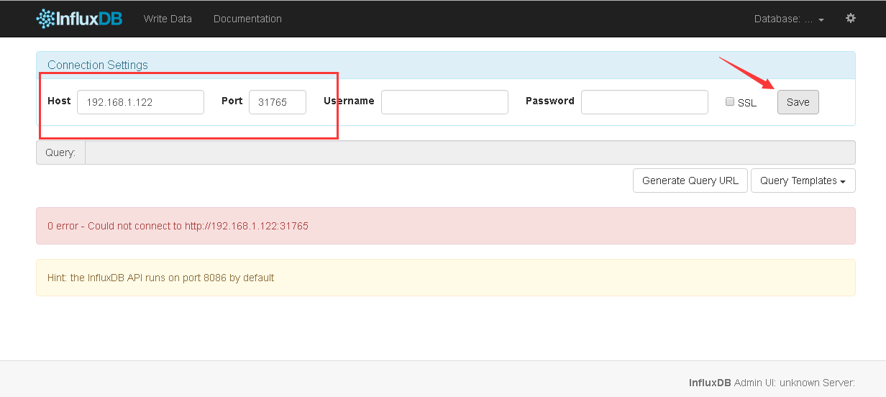

# 配置和安装 Heapster

到 [heapster release 页面](https://github.com/kubernetes/heapster/releases) 下载最新版本的 heapster。

``` bash
$ wget https://github.com/kubernetes/heapster/archive/v1.3.0.zip
$ unzip v1.3.0.zip
$ mv v1.3.0.zip heapster-1.3.0
```

文件目录： `heapster-1.3.0/deploy/kube-config/influxdb`

``` bash
$ cd heapster-1.3.0/deploy/kube-config/influxdb
$ ls *.yaml
grafana-deployment.yaml  grafana-service.yaml  heapster-deployment.yaml  heapster-service.yaml  influxdb-deployment.yaml  influxdb-service.yaml heapster-rbac.yaml
```


我这使用已经修改好的 yaml 文件见：[heapster](./yaml/heapster)

我们自己创建了heapster的rbac配置`heapster-rbac.yaml`


## 配置 grafana-deployment

``` bash
# cat grafana-deployment.yaml 
apiVersion: extensions/v1beta1
kind: Deployment
metadata:
  name: monitoring-grafana
  namespace: kube-system
spec:
  replicas: 1
  template:
    metadata:
      labels:
        task: monitoring
        k8s-app: grafana
    spec:
      containers:
      - name: grafana
        image: index.tenxcloud.com/jimmy/heapster-grafana-amd64:v4.0.2
        ports:
          - containerPort: 3000
            protocol: TCP
        volumeMounts:
        - mountPath: /var
          name: grafana-storage
        env:
        - name: INFLUXDB_HOST
          value: monitoring-influxdb
        - name: GRAFANA_PORT
          value: "3000"
          # The following env variables are required to make Grafana accessible via
          # the kubernetes api-server proxy. On production clusters, we recommend
          # removing these env variables, setup auth for grafana, and expose the grafana
          # service using a LoadBalancer or a public IP.
        - name: GF_AUTH_BASIC_ENABLED
          value: "false"
        - name: GF_AUTH_ANONYMOUS_ENABLED
          value: "true"
        - name: GF_AUTH_ANONYMOUS_ORG_ROLE
          value: Admin
        - name: GF_SERVER_ROOT_URL
          # If you're only using the API Server proxy, set this value instead:
          value: /api/v1/proxy/namespaces/kube-system/services/monitoring-grafana/
          #value: /
      volumes:
      - name: grafana-storage
        emptyDir: {}

```

+ 如果后续使用 kube-apiserver 或者 kubectl proxy 访问 grafana dashboard，则必须将 `GF_SERVER_ROOT_URL` 设置为 `/api/v1/proxy/namespaces/kube-system/services/monitoring-grafana/`，否则后续访问grafana时访问时提示找不到`http://192.168.1.121:8086/api/v1/proxy/namespaces/kube-system/services/monitoring-grafana/api/dashboards/home` 页面；


## 配置 heapster-deployment

``` bash
# cat heapster-deployment.yaml 
apiVersion: extensions/v1beta1
kind: Deployment
metadata:
  name: heapster
  namespace: kube-system
spec:
  replicas: 1
  template:
    metadata:
      labels:
        task: monitoring
        k8s-app: heapster
    spec:
      serviceAccountName: heapster
      containers:
      - name: heapster
        image: index.tenxcloud.com/jimmy/heapster-amd64:v1.3.0-beta.1
        imagePullPolicy: IfNotPresent
        command:
        - /heapster
        - --source=kubernetes:https://kubernetes.default
        - --sink=influxdb:http://monitoring-influxdb:8086

```

## 配置 influxdb-deployment

influxdb 官方建议使用命令行或 HTTP API 接口来查询数据库，从 v1.1.0 版本开始默认关闭 admin UI，将在后续版本中移除 admin UI 插件。

开启镜像中 admin UI的办法如下：先导出镜像中的 influxdb 配置文件，开启 admin 插件后，再将配置文件内容写入 ConfigMap，最后挂载到镜像中，达到覆盖原始配置的目的：

注意：yaml目录已经提供了 [修改后的 ConfigMap 定义文件](./yaml/heapster/influxdb-cm.yaml)

``` bash
# # 导出镜像中的 influxdb 配置文件
# docker run --rm --entrypoint 'cat'  -ti lvanneo/heapster-influxdb-amd64:v1.1.1 /etc/config.toml >config.toml.orig
# cp config.toml.orig config.toml
# # 修改：启用 admin 接口
# vim config.toml
# diff config.toml.orig config.toml
35c35
<   enabled = false
---
>   enabled = true
# # 将修改后的配置写入到 ConfigMap 对象中
# kubectl create configmap influxdb-config --from-file=config.toml  -n kube-system
configmap "influxdb-config" created
# # 将 ConfigMap 中的配置文件挂载到 Pod 中，达到覆盖原始配置的目的
# cat influxdb-deployment.yaml 
apiVersion: extensions/v1beta1
kind: Deployment
metadata:
  name: monitoring-influxdb
  namespace: kube-system
spec:
  replicas: 1
  template:
    metadata:
      labels:
        task: monitoring
        k8s-app: influxdb
    spec:
      containers:
      - name: influxdb
        image: index.tenxcloud.com/jimmy/heapster-influxdb-amd64:v1.1.1
        volumeMounts:
        - mountPath: /data
          name: influxdb-storage
        - mountPath: /etc/
          name: influxdb-config
      volumes:
      - name: influxdb-storage
        emptyDir: {}
      - name: influxdb-config
        configMap:
          name: influxdb-config

```

## 配置 monitoring-influxdb Service

```
# cat influxdb-service.yaml 
apiVersion: v1
kind: Service
metadata:
  labels:
    task: monitoring
    # For use as a Cluster add-on (https://github.com/kubernetes/kubernetes/tree/master/cluster/addons)
    #     # If you are NOT using this as an addon, you should comment out this line.
    kubernetes.io/cluster-service: 'true'
    kubernetes.io/name: monitoring-influxdb
  name: monitoring-influxdb
  namespace: kube-system
spec:
  type: NodePort
  ports:
  - port: 8086
    targetPort: 8086
    name: http
  - port: 8083
    targetPort: 8083
    name: admin
  selector:
    k8s-app: influxdb
```

- 定义端口类型为 NodePort，额外增加了 admin 端口映射，用于后续浏览器访问 influxdb 的 admin UI 界面；

## 执行所有定义文件

``` bash
# pwd
/root/yaml/heapster
# ls *.yaml
grafana-service.yaml      heapster-rbac.yaml     influxdb-cm.yaml          influxdb-service.yaml
grafana-deployment.yaml  heapster-deployment.yaml  heapster-service.yaml  influxdb-deployment.yaml
# kubectl create -f  .
deployment "monitoring-grafana" created
service "monitoring-grafana" created
deployment "heapster" created
serviceaccount "heapster" created
clusterrolebinding "heapster" created
service "heapster" created
configmap "influxdb-config" created
deployment "monitoring-influxdb" created
service "monitoring-influxdb" created
```


## 检查执行结果

检查 Deployment

``` bash
# kubectl get deployments -n kube-system | grep -E 'heapster|monitoring'
heapster               1         1         1            1           10m
monitoring-grafana     1         1         1            1           10m
monitoring-influxdb    1         1         1            1           10m

```

检查 Pods

``` bash
# kubectl get pods -n kube-system | grep -E 'heapster|monitoring'
heapster-2291216627-qqm6s               1/1       Running   0          10m
monitoring-grafana-2490289118-v1brc     1/1       Running   0          10m
monitoring-influxdb-1450237832-zst7c    1/1       Running   0          10m

```

检查 kubernets dashboard 界面，看是显示各 Nodes、Pods 的 CPU、内存、负载等利用率曲线图；


## 访问 grafana

1. 通过 kube-apiserver 访问：

获取 monitoring-grafana 服务 URL

 ``` bash
# kubectl cluster-info
Kubernetes master is running at https://192.168.1.121:6443
Heapster is running at https://192.168.1.121:6443/api/v1/proxy/namespaces/kube-system/services/heapster
KubeDNS is running at https://192.168.1.121:6443/api/v1/proxy/namespaces/kube-system/services/kube-dns
kubernetes-dashboard is running at https://192.168.1.121:6443/api/v1/proxy/namespaces/kube-system/services/kubernetes-dashboard
monitoring-grafana is running at https://192.168.1.121:6443/api/v1/proxy/namespaces/kube-system/services/monitoring-grafana
monitoring-influxdb is running at https://192.168.1.121:6443/api/v1/proxy/namespaces/kube-system/services/monitoring-influxd

To further debug and diagnose cluster problems, use 'kubectl cluster-info dump'.

  ```

    浏览器访问 URL： `http://192.168.1.121:8080/api/v1/proxy/namespaces/kube-system/services/monitoring-grafana`

2. 通过 kubectl proxy 访问：

创建代理
``` bash
# kubectl proxy --address='192.168.1.121' --port=8086 --accept-hosts='^*$'
Starting to serve on 192.168.1.121:8086
```

浏览器访问 URL：`http://192.168.1.121:8086/api/v1/proxy/namespaces/kube-system/services/monitoring-grafana`



## 访问 influxdb admin UI

获取 influxdb http 8086 映射的 NodePort

```
# kubectl get svc -n kube-system|grep influxdb
monitoring-influxd     10.254.193.23    <nodes>       8086:31765/TCP,8083:32494/TCP   51m
```

通过 kube-apiserver 的**非安全端口**访问 influxdb 的 admin UI 界面： `http://192.168.1.121:8080/api/v1/proxy/namespaces/kube-system/services/monitoring-influxdb:8083/`

在页面的 “Connection Settings” 的 Host 中输入 node IP， Port 中输入 8086 映射的 nodePort 如上面的 31765，点击 “Save” 即可（我的集群中的地址是192.168.1.121:31765）：



